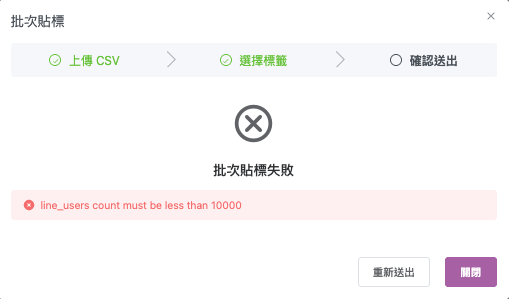
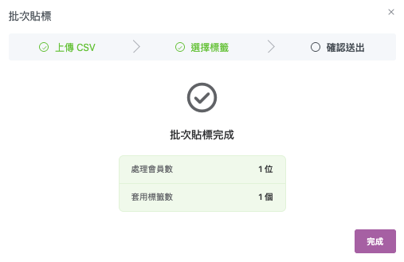
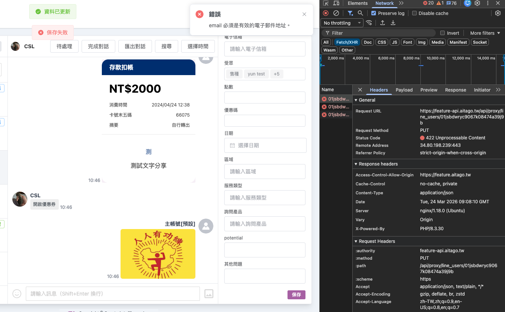
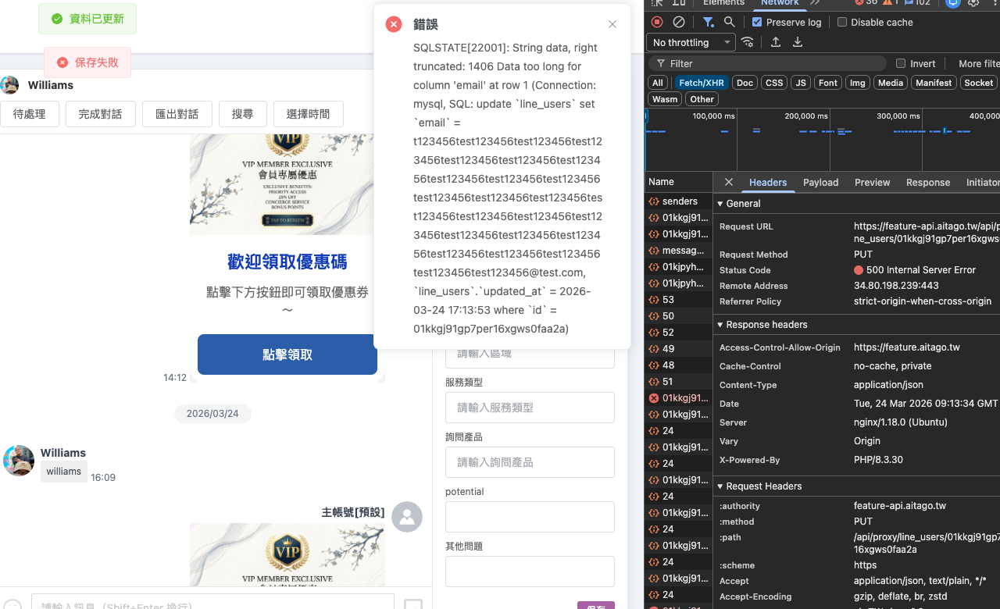
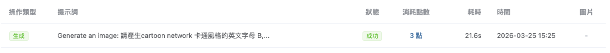

# 測試報告 — AGO-146 / 149 / 150 / 151 / 152

## 基本資訊

| 項目 | 內容 |
|------|------|
| 報告類型 | Feature 環境測試 |
| 測試日期 | 2026-03-26 |
| 測試環境 | https://feature.aitago.tw/ |
| 測試人員 | williamsliu |
| 測試工具 | MeterSphere（手動執行） |

---

## 總覽

| 工單 | 功能摘要 | 總案例 | ✅ Pass | ❌ Fail | 🚧 Blocked | 結果 |
|------|---------|--------|---------|---------|-----------|------|
| [AGO-146](#ago-146) | 批次貼標（CSV 上傳） | 18 | 14 | 2 | 2 | ⚠️ 有異常 |
| [AGO-149](#ago-149) | 訊息中心篩選回覆人帳號 | 24 | 21 | 0 | 3 | 🚧 有阻擋 |
| [AGO-150](#ago-150) | 訊息中心 Email 欄位可編輯 | 10 | 7 | 3 | 0 | ⚠️ 有異常 |
| [AGO-151](#ago-151) | AI 生圖點數限制 | 8 | 5 | 2 | 1 | ⚠️ 有異常 |
| [AGO-152](#ago-152) | 群發訊息分析浮動面板 | 10 | 8 | 2 | 0 | ⚠️ 有異常 |
| **合計** | | **70** | **55** | **9** | **6** | |

> 通過率（排除 Blocked）：55 / 64 = **85.9%**

---

## AGO-146 批次貼標功能

> MeterSphere 計畫：[AGO-146-批次貼標-手動測試](http://10.9.0.11:8081/test-plan/20396318652375040)

### Step 1：CSV 上傳 + 欄位映射

| 案例 | 結果 | 備註 |
|------|------|------|
| 1-02 上傳空白 CSV（只有 header，無資料列） | ✅ Pass | |
| 1-03 上傳 CSV 缺少 Login Id 欄位 | ✅ Pass | |
| 1-04 上傳非 CSV 格式檔案（如 .xlsx / .txt） | ✅ Pass | |
| 1-05 上傳超大量資料 CSV（> 10,000 筆） | ❌ Fail | |
| 1-07 欄位映射畫面正確顯示 CSV 欄位 | ✅ Pass | |
| 1-08 未完成欄位映射直接點下一步 | ✅ Pass | |

### Step 2：選擇標籤

| 案例 | 結果 | 備註 |
|------|------|------|
| 2-01 選擇既有標籤 | ✅ Pass | |
| 2-02 輸入新標籤名稱建立 | ✅ Pass | |
| 2-03 新標籤名稱輸入空白 | ✅ Pass | |
| 2-04 新標籤名稱輸入已存在的名稱 | 🚧 Blocked | |
| 2-05 既有標籤與新建標籤皆未選擇，點下一步 | ✅ Pass | |
| 2-07 新標籤名稱輸入超長字串 | 🚧 Blocked | |

### Step 3：確認送出 + 進度 + 結果

| 案例 | 結果 | 備註 |
|------|------|------|
| 3-01 正常流程：送出後顯示處理進度 | ✅ Pass | |
| 3-02 回傳統計數值正確（total / matched / unmatched） | ✅ Pass | |
| 3-03 全部 Login ID 均匹配 | ✅ Pass | |
| 3-04 全部 Login ID 均未匹配 | ✅ Pass | |
| 3-05 已有該標籤的會員再次貼標不重複 | ❌ Fail | |
| 3-06 送出後返回會員列表確認標籤掛載 | ✅ Pass | |

**小計：14 Pass / 2 Fail / 2 Blocked（共 18 案例）**

---

## AGO-149 訊息中心：篩選回覆人帳號

> MeterSphere 計畫：[AGO-149-訊息中心篩選-手動測試](http://10.9.0.11:8081/test-plan/20396456091328534)

### 篩選器 UI

| 案例 | 結果 | 備註 |
|------|------|------|
| 1-01 開啟篩選面板確認四個區塊完整顯示 | ✅ Pass | |

### 訊息 / 狀態 / 回覆 三區互斥行為

| 案例 | 結果 | 備註 |
|------|------|------|
| 2-01 訊息區 → 再選狀態區應自動互斥 | ✅ Pass | |
| 2-02 狀態區 → 再選回覆區應自動互斥 | ✅ Pass | |
| 2-03 回覆區 → 再選訊息區應自動互斥 | ✅ Pass | |
| 2-04 連續切換三區確認全程互斥 | ✅ Pass | |

### 訊息 / 狀態 / 回覆區塊篩選功能

| 案例 | 結果 | 備註 |
|------|------|------|
| 3-01 選「未讀訊息」列表正確 | ✅ Pass | |
| 3-02 選「已讀訊息」列表正確 | ✅ Pass | |
| 4-01 選「未指派」列表正確 | ✅ Pass | |
| 4-02 選「已指派」列表正確 | ✅ Pass | |
| 4-03 選「已完成」列表正確 | ✅ Pass | |
| 4-04 選「待轉接」列表正確 | 🚧 Blocked | |
| 5-01 選「AI客服」列表正確 | ✅ Pass | |
| 5-02 選「真人客服」列表正確 | ✅ Pass | |

### 負責人篩選 / 跨區疊加 / 標題顯示 / 邊界

| 案例 | 結果 | 備註 |
|------|------|------|
| 6-01 選特定負責人列表正確 | ✅ Pass | |
| 6-02 切換負責人前者選項自動取消 | ✅ Pass | |
| 6-03 點「所有人」清除負責人篩選 | ✅ Pass | |
| 7-01 未讀訊息 + 特定負責人疊加 | ✅ Pass | |
| 7-02 已完成 + 特定負責人疊加 | ✅ Pass | |
| 7-03 真人客服 + 特定負責人疊加 | ✅ Pass | |
| 8-01 標題顯示正確格式 | ✅ Pass | |
| 8-02 選中項目藍色粗體視覺標示 | ✅ Pass | |
| 8-03 點擊標題文字重置所有篩選 | 🚧 Blocked | |
| 9-01 篩選結果為零筆時空狀態提示 | ✅ Pass | |
| 9-02 負責人帳號列表為空時的邊界處理 | 🚧 Blocked | |

**小計：21 Pass / 0 Fail / 3 Blocked（共 24 案例）**

---

## AGO-150 訊息中心：會員電子信箱可編輯

> MeterSphere 計畫：[AGO-150-Email可編輯-手動測試](http://10.9.0.11:8081/test-plan/20396507630936071)

| 案例 | 結果 | 備註 |
|------|------|------|
| 1-01 Email 欄位可點擊進入編輯狀態 | ✅ Pass | |
| 1-02 輸入合規 Email 並儲存成功 | ✅ Pass | |
| 1-03 輸入不合規 Email 格式 | ❌ Fail | |
| 1-04 清空 Email 欄位後儲存 | ❌ Fail | |
| 1-05 輸入超長 Email 字串 | ❌ Fail | |
| 1-06 輸入含空白字元的 Email | ✅ Pass | |
| 1-07 儲存時 API 失敗（500 / 422） | ✅ Pass | |
| 1-08 編輯後點取消或離開 | ✅ Pass | |
| 1-09 儲存後重整頁面確認持久化 | ✅ Pass | |
| 1-10 確認會員列表頁 Email 同步更新 | ✅ Pass | |

**小計：7 Pass / 3 Fail / 0 Blocked（共 10 案例）**

---

## AGO-151 AI 生圖點數限制

> MeterSphere 計畫：[AGO-151-AI生圖點數-手動測試](http://10.9.0.11:8081/test-plan/20396576350412810)

### 點數顯示

| 案例 | 結果 | 備註 |
|------|------|------|
| 1-01 頁面正確顯示目前剩餘點數 | ✅ Pass | |
| 1-02 儀表板顯示本次花費點數 | ✅ Pass | |
| 1-03 生成 1 張圖後剩餘點數扣 3 點 | ❌ Fail | |

### 前端卡控

| 案例 | 結果 | 備註 |
|------|------|------|
| 2-01 點數充足時按鈕可點擊 | ✅ Pass | |
| 2-02 點數為 0 時按鈕 disabled | ✅ Pass | |
| 2-03 點數不足 3 點時按鈕狀態 | ✅ Pass | |
| 2-04 點數耗盡時繞過前端強制觸發 API | ❌ Fail | |

### 月重置

| 案例 | 結果 | 備註 |
|------|------|------|
| 3-01 確認月重置機制存在 | 🚧 Blocked | 需與 RD 確認排程設定 |

**小計：5 Pass / 2 Fail / 1 Blocked（共 8 案例）**

---

## AGO-152 群發訊息分析：訊息預覽浮動面板

> MeterSphere 計畫：[AGO-152-訊息預覽浮動面板-手動測試](http://10.9.0.11:8081/test-plan/20396627890020360)

### 面板開啟 / 關閉

| 案例 | 結果 | 備註 |
|------|------|------|
| 1-01 點擊訊息項目觸發浮動面板開啟 | ✅ Pass | |
| 1-02 點擊關閉按鈕或面板外部關閉面板 | ✅ Pass | |
| 1-03 面板開啟時背景列表行為確認 | ✅ Pass | |

### 訊息預覽內容

| 案例 | 結果 | 備註 |
|------|------|------|
| 2-01 面板正確顯示對應訊息圖片 | ✅ Pass | |
| 2-02 圖片載入失敗時的處理 | ✅ Pass | |
| 2-03 訊息含多張圖片時可切換預覽 | ✅ Pass | |
| 2-04 訊息為純文字時面板顯示處理 | ✅ Pass | |

### 圖片下載

| 案例 | 結果 | 備註 |
|------|------|------|
| 3-01 點擊下載按鈕圖片正確下載 | ❌ Fail | |
| 3-02 圖片下載時 API 失敗顯示提示 | ❌ Fail | |

### 資料正確性

| 案例 | 結果 | 備註 |
|------|------|------|
| 4-01 不同群發訊息開啟面板各自對應正確 | ✅ Pass | |

**小計：8 Pass / 2 Fail / 0 Blocked（共 10 案例）**

---

## 缺陷列表

> 資料來源：MeterSphere 執行歷史（`/test-plan/functional/case/exec/history`）
> 點擊工單號可從總覽直接跳轉至對應缺陷區塊。

---

### AGO-146

> 批次貼標功能 ・ ❌ 2 Fail ／ 🚧 2 Blocked

#### ❌ Fail（2 筆）

**#1 1-05｜上傳超大量資料 CSV（> 10,000 筆）**
- **嚴重度**：P2
- **測試備註**：`line_users count must be less than 10000`
- **問題說明**：系統對 CSV 上傳筆數有 10,000 筆上限，超過時回傳錯誤，但錯誤訊息為原始 API 回應，未轉譯為使用者可讀的提示文字
- **截圖**：

  

**#2 3-05｜已有標籤的會員再次貼標不重複**
- **嚴重度**：P2
- **測試備註**：該標籤該成員已貼過、但仍顯示套用標籤數 1
- **問題說明**：對已掛有目標標籤的會員執行批次貼標，預期應跳過並反映在統計數值（matched 但不重複貼），實際統計數值不正確仍計入
- **截圖**：

  

#### 🚧 Blocked（2 筆）

| # | 案例 | 阻擋原因 |
|---|------|---------|
| B1 | 2-04 新標籤名稱輸入已存在的名稱 | 目前新增標籤不會提示重複、且貼標功能異常，無法確認此行為 |
| B2 | 2-07 新標籤名稱輸入超長字串 | 目前新增標籤功能失敗，前置條件不滿足，無法執行 |

---

### AGO-149

> 訊息中心：篩選回覆人帳號 ・ 🚧 3 Blocked

#### 🚧 Blocked（3 筆）

| # | 案例 | 阻擋原因 |
|---|------|---------|
| B3 | 4-04 選「待轉接」列表僅顯示待轉接對話 | 目前沒有「待轉接」功能，暫不測試 |
| B4 | 8-03 點擊標題文字重置所有篩選條件 | 測試環境無法觸發重置行為，待確認觸發條件 |
| B5 | 9-02 負責人帳號列表為空時的邊界處理 | 測試環境無法模擬無客服帳號的空環境 |

---

### AGO-150

> 訊息中心：會員電子信箱可編輯 ・ ❌ 3 Fail

#### ❌ Fail（3 筆）

**#3 1-03｜輸入不合規 Email 格式**
- **嚴重度**：P1
- **測試備註**：不合規之 Email 沒有檢查，包含 Email 字串中帶有空格也可通過
- **問題說明**：輸入 `abc`、`abc@`、`@abc.com`、含空格的字串均可通過儲存，前端無任何格式驗證阻擋

**#4 1-04｜清空 Email 欄位後儲存**
- **嚴重度**：P2
- **測試備註**：Email 欄位原本若無資料，保存時顯示「保存失敗」「email 必須是有效的電子郵件地址。」
- **問題說明**：空值儲存時後端回傳 422 格式驗證錯誤，但錯誤訊息為原始 API 回應，未轉為友善提示；此外規格未定義是否允許清空，建議與 PM 確認
- **截圖**：

  

**#5 1-05｜輸入超長 Email 字串**
- **嚴重度**：P2
- **測試備註**：顯示後端回傳錯誤，訊息沒有修飾或正確提示用戶
- **問題說明**：輸入超過 255 字元時後端回傳錯誤，前端直接顯示原始錯誤訊息，無長度上限提示或截斷處理
- **截圖**：

  

---

### AGO-151

> AI 生圖點數限制 ・ ❌ 2 Fail ／ 🚧 1 Blocked

#### ❌ Fail（2 筆）

**#6 1-03｜生成 1 張圖後剩餘點數扣 3 點**
- **嚴重度**：P1
- **測試備註**：有機率發生生圖成功但圖片沒有出現的情況
- **問題說明**：AI 生圖執行後有機率圖片不顯示（但點數仍被扣除），非 100% 必現，屬間歇性失敗，建議 RD 確認 GCS 上傳或回傳邏輯
- **截圖**：

  

**#7 2-04｜點數耗盡時繞過前端強制觸發 API**
- **嚴重度**：P1
- **問題說明**：後端有正確回傳 402 錯誤（`insufficient_points`），但前端收到錯誤後顯示「未知方案」而非正確的「點數不足」提示，屬前端錯誤訊息解析與顯示問題

#### 🚧 Blocked（1 筆）

| # | 案例 | 阻擋原因 |
|---|------|---------|
| B6 | 3-01 確認月重置機制存在 | 暫不測試，需與 RD 確認排程設定後補 |

---

### AGO-152

> 群發訊息分析：訊息預覽浮動面板 ・ ❌ 2 Fail

#### ❌ Fail（2 筆）

**#8 3-01｜點擊下載按鈕圖片正確下載**
- **嚴重度**：P1
- **測試備註**：影片訊息無法正確顯示
- **問題說明**：群發訊息類型為影片時，浮動面板無法正確顯示影片內容；下載功能亦異常，建議確認影片類型的預覽與下載邏輯是否有另行處理
- **截圖**：

  

**#9 3-02｜圖片下載時 API 失敗**
- **嚴重度**：P2
- **測試備註**：斷網仍可下載，但會下載到只有背景的畫面
- **問題說明**：在網路異常情況下，下載動作仍觸發成功但產出的檔案僅含背景，無實際圖片內容；前端對下載失敗無錯誤提示
- **截圖**：

  

---

## 結論

| 統計項目 | 數值 |
|---------|------|
| 測試工單數 | 5 |
| 總測試案例 | 70 |
| ✅ Pass | 55 |
| ❌ Fail | 9 |
| 🚧 Blocked | 6 |
| 通過率（排除 Blocked） | 85.9%（55/64） |
| 發現缺陷 | 9 |

AGO-149 主要功能全數通過，Blocked 案例（4-04 待轉接、8-03 重置、9-02 空帳號）因測試環境無對應資料，非功能缺陷。AGO-150 Email 格式驗證有 3 個失敗，建議優先處理 1-03（不合規格式未被阻擋）。AGO-151 點數扣除後圖片不顯示（1-03）為 P1 缺陷需 RD 確認；2-04 後端已正確回傳 402（`insufficient_points`），但前端錯誤訊息顯示「未知方案」，屬前端 P1 修正。AGO-152 下載功能（3-01 / 3-02）無法正常運作，屬 P1 問題。AGO-146 重複貼標（3-05）與大量 CSV（1-05）為 P2，對主流程影響較低。
