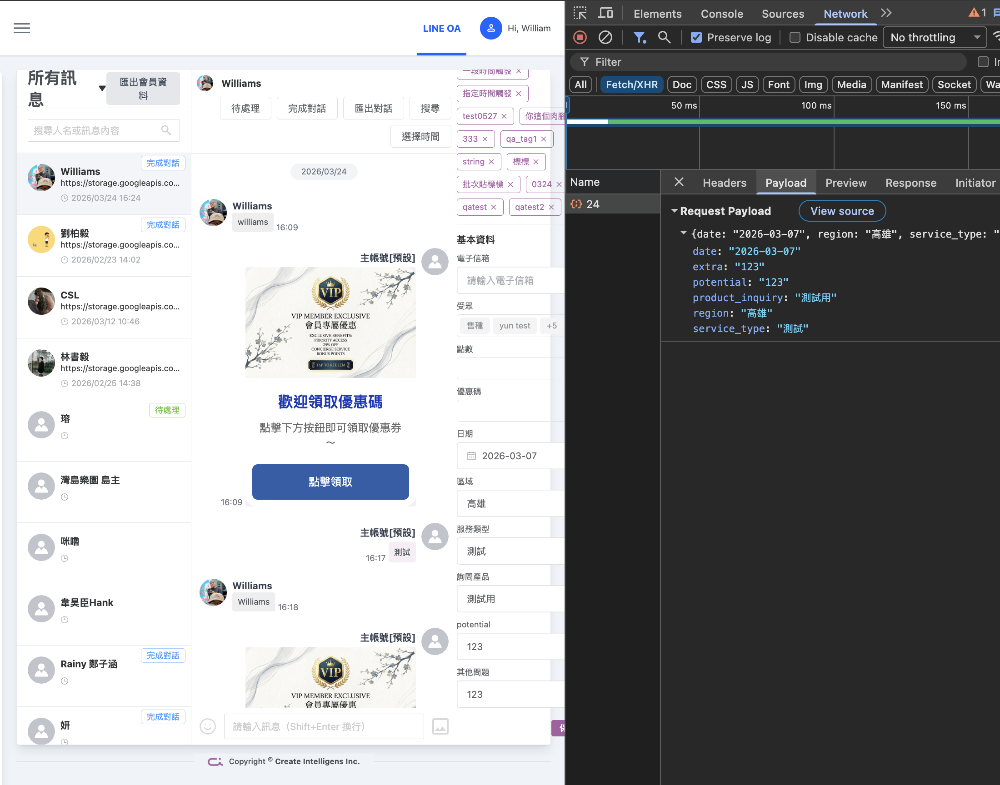
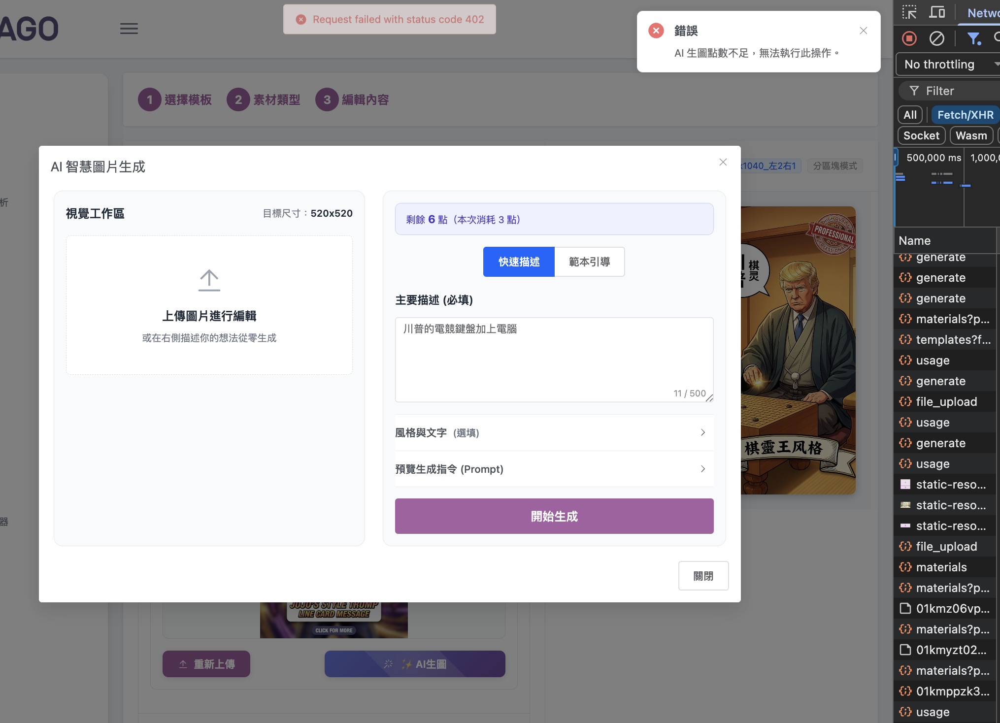
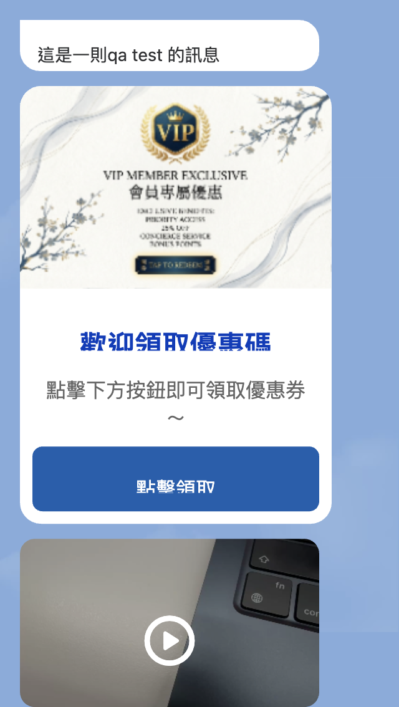
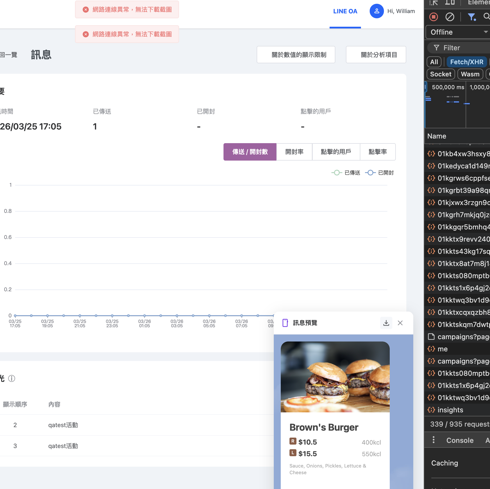

# 覆驗測試報告 — AGO-146 / 149 / 150 / 151 / 152

## 基本資訊

| 項目 | 內容 |
|------|------|
| 報告類型 | Feature 環境覆驗測試（Retest） |
| 測試日期 | 2026-03-30 |
| 前次報告 | [2026-03-26 Feature 測試報告](../AGO-146-149-150-151-152-20260326-feature/test-report.md) |
| 測試環境 | https://feature.aitago.tw/ |
| 測試人員 | williamsliu |
| 測試工具 | MeterSphere（手動執行） |

---

## 總覽

> 本次覆驗針對前次報告中 ❌ Fail / 🚧 Blocked 項目，上次已通過的案例不再列出。

| 工單 | 功能摘要 | 前次缺陷 | 本次覆驗 | 結果 |
|------|---------|---------|---------|------|
| AGO-146 | 批次貼標（CSV 上傳） | 2 Fail / 2 Blocked | 未覆驗 | ⏸ 待排 |
| AGO-149 | 訊息中心篩選回覆人帳號 | 3 Blocked | 未覆驗 | ⏸ 待排 |
| [AGO-150](#ago-150-覆驗) | 訊息中心 Email 欄位可編輯 | 3 Fail | 3/3 已覆驗 | ✅ 全數通過 |
| [AGO-151](#ago-151-覆驗) | AI 生圖點數限制 | 2 Fail / 1 Blocked | 2/2 Fail 已覆驗 | ⚠️ 部分通過 |
| [AGO-152](#ago-152-覆驗) | 群發訊息分析浮動面板 | 2 Fail | 2/2 已覆驗 | ✅ 全數通過 |

### 覆驗統計

| 統計項目 | 數值 |
|---------|------|
| 前次 Fail 總數 | 9 |
| 本次覆驗 Fail 數 | 7 |
| ✅ 覆驗通過 | 6 |
| ⚠️ 覆驗 Blocked | 1 |
| 覆驗通過率 | 85.7%（6/7） |
| 尚未覆驗 Fail | 2（AGO-146） |
| 前次 Blocked 總數 | 6（均未覆驗） |

---

## AGO-150 覆驗

> 訊息中心：會員電子信箱可編輯
> MeterSphere 計畫：[AGO-150-Email可編輯-手動測試](http://10.9.0.11:8081/test-plan/20396507630936071)

| # | 案例 | 前次結果 | Bug 單 | 覆驗結果 | 覆驗說明 |
|---|------|---------|--------|---------|---------|
| #3 | 1-03｜輸入不合規 Email 格式 | ❌ Fail (P1) | [AGO-161](https://ai360c.atlassian.net/browse/AGO-161) | ✅ Pass | 針對以下內容皆有阻擋：含空白字元、無前綴、無 @、無 domain、無 .（實際為後端阻擋） |
| #4 | 1-04｜清空 Email 欄位後儲存 | ❌ Fail (P2) | [AGO-162](https://ai360c.atlassian.net/browse/AGO-162) | ✅ Pass | AGO-162 更新後驗證通過 |
| #5 | 1-05｜輸入超長 Email 字串 | ❌ Fail (P2) | [AGO-163](https://ai360c.atlassian.net/browse/AGO-163) | ✅ Pass | 已限制 255 字元，不可輸入第 256 字元 |

**覆驗結論：3/3 全數通過，AGO-150 缺陷全部修復。**

### 覆驗截圖

**AGO-162（1-04 清空 Email 欄位後儲存）**

---

## AGO-151 覆驗

> AI 生圖點數限制
> MeterSphere 計畫：[AGO-151-AI生圖點數-手動測試](http://10.9.0.11:8081/test-plan/20396576350412810)

| # | 案例 | 前次結果 | Bug 單 | 覆驗結果 | 覆驗說明 |
|---|------|---------|--------|---------|---------|
| #6 | 1-03｜生成 1 張圖後剩餘點數扣 3 點 | ❌ Fail (P1) | [AGO-164](https://ai360c.atlassian.net/browse/AGO-164) | ⚠️ Blocked | 目前暫時測不到生圖成功但取圖逾時的狀況，有測到再補紀錄 |
| #7 | 2-04｜點數耗盡時繞過前端強制觸發 API | ❌ Fail (P1) | [AGO-165](https://ai360c.atlassian.net/browse/AGO-165) | ✅ Pass | 「AI 生圖點數不足，無法執行此操作。」 |

**前次 Blocked（未覆驗）：**

| # | 案例 | 狀態 | 說明 |
|---|------|------|------|
| B6 | 3-01 確認月重置機制存在 | 🚧 Blocked | 需與 RD 確認排程設定，維持前次狀態 |

**覆驗結論：1/2 通過；AGO-164（1-03 生圖取圖逾時）本次無法重現，標記 Blocked 待後續追蹤。**

### 覆驗截圖

**AGO-165（2-04 點數耗盡時繞過前端強制觸發 API）**

---

## AGO-152 覆驗

> 群發訊息分析：訊息預覽浮動面板
> MeterSphere 計畫：[AGO-152-訊息預覽浮動面板-手動測試](http://10.9.0.11:8081/test-plan/20396627890020360)

| # | 案例 | 前次結果 | Bug 單 | 覆驗結果 | 覆驗說明 |
|---|------|---------|--------|---------|---------|
| #8 | 3-01｜點擊下載按鈕圖片正確下載 | ❌ Fail (P1) | [AGO-166](https://ai360c.atlassian.net/browse/AGO-166) | ✅ Pass | 影片訊息正確顯示預覽圖 |
| #9 | 3-02｜圖片下載時 API 失敗顯示提示 | ❌ Fail (P2) | [AGO-167](https://ai360c.atlassian.net/browse/AGO-167) | ✅ Pass | 「網路連線異常，無法下載截圖」 |

**覆驗結論：2/2 全數通過，AGO-152 缺陷全部修復。**

### 覆驗截圖

**AGO-166（3-01 影片預覽與下載）**

**AGO-167（3-02 下載失敗提示）**

---

## 未覆驗項目（待排）

### AGO-146 批次貼標功能

#### ❌ Fail（2 筆，未覆驗）

| # | 案例 | 嚴重度 | 問題說明 |
|---|------|--------|---------|
| #1 | 1-05｜上傳超大量資料 CSV（> 10,000 筆） | P2 | 超過 10,000 筆時錯誤訊息為原始 API 回應，未轉譯為使用者可讀提示 |
| #2 | 3-05｜已有標籤的會員再次貼標不重複 | P2 | 對已掛有目標標籤的會員貼標，統計數值仍計入，不正確 |

#### 🚧 Blocked（2 筆，未覆驗）

| # | 案例 | 阻擋原因 |
|---|------|---------|
| B1 | 2-04 新標籤名稱輸入已存在的名稱 | 新增標籤不會提示重複、貼標功能異常 |
| B2 | 2-07 新標籤名稱輸入超長字串 | 新增標籤功能失敗，前置條件不滿足 |

### AGO-149 訊息中心篩選

#### 🚧 Blocked（3 筆，未覆驗）

| # | 案例 | 阻擋原因 |
|---|------|---------|
| B3 | 4-04 選「待轉接」列表 | 目前沒有「待轉接」功能 |
| B4 | 8-03 點擊標題文字重置所有篩選 | 測試環境無法觸發重置行為 |
| B5 | 9-02 負責人帳號列表為空時邊界處理 | 無法模擬無客服帳號的空環境 |

---

## 結論

本次覆驗 7 筆前次 Fail 項目（AGO-150 × 3、AGO-151 × 2、AGO-152 × 2），其中 **6 筆驗證通過、1 筆標記 Blocked**。

| 項目 | 結論 |
|------|------|
| **AGO-150**（Email 編輯）| ✅ 3/3 缺陷全數修復，可結案 |
| **AGO-151**（AI 生圖點數）| ⚠️ AGO-165 通過；AGO-164 間歇性問題本次無法重現，Blocked 待追蹤 |
| **AGO-152**（浮動面板）| ✅ 2/2 缺陷全數修復，可結案 |
| **AGO-146**（批次貼標）| ⏸ 2 Fail + 2 Blocked 未覆驗 |
| **AGO-149**（篩選帳號）| ⏸ 3 Blocked 未覆驗（非功能缺陷，為環境限制） |

**整體缺陷修復進度：6/9 Fail 已修復（66.7%），剩餘 AGO-146 × 2 + AGO-164 × 1 待處理。**
