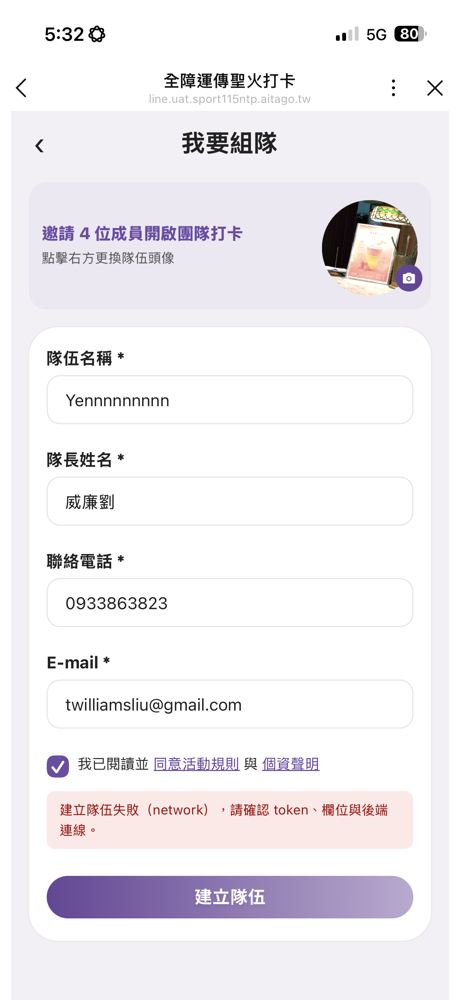
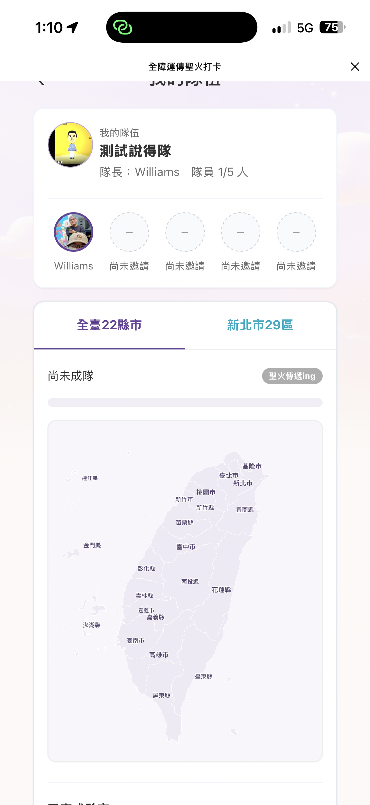
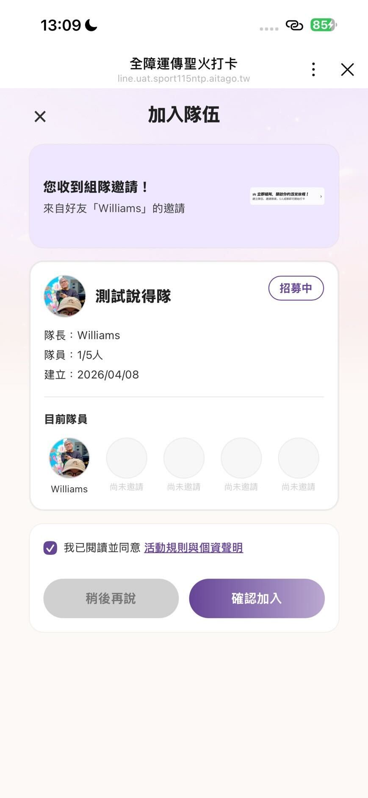
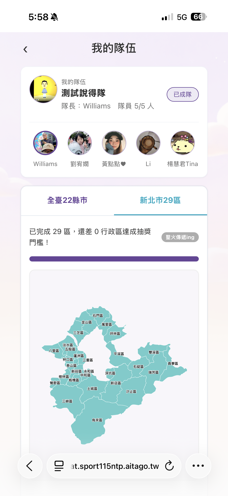
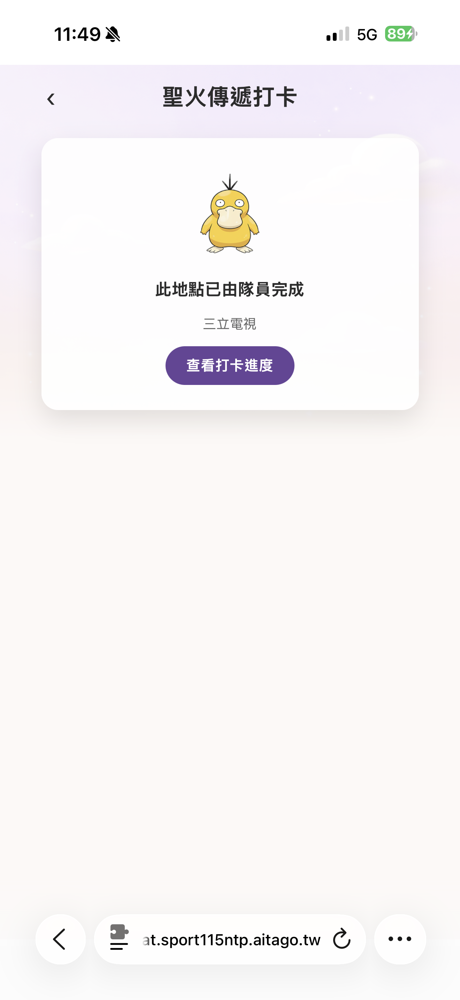

# 測試報告 — AGO-175 新北打卡功能（組隊 / 打卡 / 進度）

## 基本資訊

| 項目 | 內容 |
|------|------|
| 工單 | [AGO-175](https://ai360c.atlassian.net/browse/AGO-175)（父單：[AGO-123](https://ai360c.atlassian.net/browse/AGO-123)） |
| 測試日期 | 2026-04-07 ~ 2026-04-10 |
| 測試環境 | UAT（https://uat.sport115ntp.aitago.tw/） |
| 測試人員 | williamsliu |
| 測試工具 | MeterSphere（手動執行 + API 自動化輔助） |
| MeterSphere 計畫 | [AGO-175 新北打卡](http://10.9.0.11:8081/#/test-plan/8442222076829696) |

---

## 總覽

| 統計項目 | 數值 |
|---------|------|
| 計畫內案例總數 | 41 |
| ✅ Pass | 38 |
| ❌ Fail | 2 |
| 🚧 Blocked | 2 |
| ⏸ Pending | 0 |
| 計畫外問題 | 4 |
| **通過率** | **92.7%（38/41）** |

---

## 模組一：組隊 — 建立隊伍（6 案例）

| # | 案例 | 結果 | 說明 |
|---|------|------|------|
| T-01 | 建立隊伍 — 正常流程 | ✅ Pass | LIFF 表單 + 頭像上傳 + 頁面跳轉正常 |
| T-02 | 建立隊伍 — 表單驗證 | ✅ Pass | 名稱/電話/Email/勾選驗證均正確 |
| T-03 | 建立隊伍 — 重複隊名 | ✅ Pass | DB UNIQUE 約束正確回傳錯誤 |
| T-04 | 建立隊伍 — 隊長電話/Email 重複 | ✅ Pass | 重複值正確被拒絕 |
| T-05 | 已加入隊伍的用戶嘗試建立 | ✅ Pass | 後端檢查用戶歸屬正確 |
| T-06 | 建立成功後取得並分享邀請連結 | ✅ Pass | LINE 分享 + flex message 正常 |

---

## 模組二：組隊 — 邀請加入（7 案例）

| # | 案例 | 結果 | 說明 |
|---|------|------|------|
| T-07 | 受邀加入 — 正常流程（3 步驟） | ✅ Pass | 跨帳號邀請 + LIFF 確認頁正常 |
| T-08 | 受邀 — 點「稍後再說」 | ✅ Pass | 頁面關閉後再點連結仍可用 |
| T-09 | 受邀 — 未加入 LINE OA | ✅ Pass | 加好友流程 + 自動跳轉正常 |
| T-10 | 受邀 — 已加入其他隊伍 | ✅ Pass | 後端拒絕重複加入 |
| T-11 | 受邀 — 隊伍已滿 5 人 | ✅ Pass | 人數上限驗證正確 |
| T-12 | 湊滿 5 人 — 狀態變更 | ✅ Pass | 「已成隊」+ 「可開始打卡」顯示正確 |
| T-13 | 隊伍頁面顯示驗證 | ✅ Pass | 進度區塊 / 隊員列表 / 邀請按鈕佈局正確 |

---

## 模組三：打卡功能（9 案例）

| # | 案例 | 結果 | 說明 |
|---|------|------|------|
| C-01 | 打卡 — 正常流程 | ✅ Pass | GPS + 拍照 + 合成照顯示正常 |
| C-02 | 打卡 — 未組隊或未滿 5 人 | ✅ Pass | 前端「尚未完成組隊」提示正確 |
| C-03 | 打卡 — GPS 拒絕授權 | ✅ Pass | GPS 權限互動正確 |
| C-04 | 打卡 — 附近無打卡點 | ✅ Pass | 「請移至指定位置」提示正確 |
| C-05 | 打卡 — 上傳失敗（後端驗證不通過） | ✅ Pass | 缺少欄位 / 無效參數均正確拒絕 |
| C-06 | 同隊同打卡點重複打卡 | ✅ Pass | DB unique 約束拒絕「已打卡過」 |
| C-07 | 打卡成功 — 下載圖片 | ✅ Pass | 合成照片下載至手機相簿正常 |
| C-08 | 打卡成功 — 分享 | 🚧 Blocked | LINE 分享面板未能正確觸發，待確認 LIFF SDK 版本 |
| C-09 | 打卡 — 照片相關驗證 | ❌ Fail (P2) | 詳見下方缺陷說明 |

---

## 模組四：進度與抽獎資格（9 案例 + 補充 4 案例）

| # | 案例 | 結果 | 說明 |
|---|------|------|------|
| P-01 | 進度頁 — 路線一部分完成 | ✅ Pass | 聖火點亮 / 跨任務聯動正確 |
| P-02 | 進度頁 — 臺灣任務完成 + 抽獎資格開啟 | ✅ Pass | 22 縣市全到 + 全員達標 → 完成 |
| P-03 | 進度頁 — 路線二未達標提示 | ✅ Pass | 新北地圖部分亮 / 部分灰正確 |
| P-04 | 進度頁 — 新北任務完成 + 抽獎資格開啟 | ✅ Pass | 29 行政區全到 + 全員達標 → 完成 |
| P-05 | 臺灣任務 — 區域未全覆蓋但全員有打卡 | ✅ Pass | 仍未完成，前端「繼續打卡」正確 |
| P-06 | 不同隊員打卡 — 進度合併 + 同區不重複推進 | ✅ Pass | 5 人畫面一致 / 同區不重複推進 |
| P-07 | 隊伍頁 — 隊員打卡次數與已完成點 | ✅ Pass | 隊員列表 + 聖火火把正確 |
| P-08 | 進度頁 — tab 切換 | ✅ Pass | 兩 tab 切換正確 |
| P-09 | 「前往打卡」按鈕 | ✅ Pass | 跳轉至 GPS 偵測流程正常 |
| P-10 | 跨任務聯動 — 打新北點同步更新臺灣任務 | ✅ Pass | 新北 +1 / 臺灣「新北市」同步覆蓋 |
| P-11 | 臺灣任務完成條件 — 隊員門檻未達 | ✅ Pass | 22 縣市全到但有隊員 0 打卡 → 未完成 |
| P-12 | 新北任務完成條件 — 隊員門檻未達 | ✅ Pass | 29 行政區全到但有隊員 0 打卡 → 未完成 |
| E-05 | 同行政區不同點被同隊兩人打 — 進度驗證 | ✅ Pass | 兩次打卡允許，行政區進度只算 1 次 |

---

## 模組五：異常與邊界（6 案例）

| # | 案例 | 結果 | 說明 |
|---|------|------|------|
| C-10 | 同隊不同隊員打同一點（點位獨佔） | ✅ Pass | 點位獨佔機制正確 |
| C-11 | 跨隊隊員打同一個點 | ✅ Pass | 各隊獨立，互不影響 |
| E-01 | 同隊兩人同時打卡同一點 | ✅ Pass | 並發控制正確，僅一人成功 |
| E-02 | 弱網環境打卡 | ❌ Fail (P2) | 弱網下已組隊用戶顯示「尚未完成組隊」錯誤提示，詳見缺陷說明 |
| E-03 | 活動截止後操作（2026.05.22 後） | 🚧 Blocked | 暫不測試，待與 Daniel 確認測試方式 |
| E-04 | flex message 邀請連結 — 隊伍已滿後點擊 | ✅ Pass | 已滿拒絕加入正確 |

---

## 缺陷清單

### ❌ Fail — 計畫內案例

#### BUG-1：C-09 上傳超大圖片（>10MB）打卡失敗但無明確錯誤提示

| 項目 | 內容 |
|------|------|
| 嚴重度 | P2 (Medium) |
| 案例 | C-09 打卡 — 照片相關驗證（Step 3：上傳超大圖片） |
| 環境 | UAT（line.uat.sport115ntp.aitago.tw） |
| 測試方式 | API 測試（手邊無法拍出 >10MB 照片，以 API 直接上傳驗證） |
| API | `POST /api/check-in` |
| 打卡者 | 楊慧君Tina（`U0be4931cda632ac3bc96846dd309b5ac`） |
| 測試時間 | 2026-04-08 15:27~15:28 UTC |
| Request 參數 | `line_user_id=U0be4931cda632ac3bc96846dd309b5ac`、`check_in_point_id=01km53yg2d9phczt2c46tn3xdj`（三重仁政店）、`gps_location=25.0794048,121.4913522`、`check_in_picture=15mb_269375095_11147025.png`（15,472,118 bytes） |
| 問題說明 | 上傳 15MB 圖片打卡，伺服器回傳 HTTP 302 redirect（Location: 首頁）而非標準錯誤碼（如 413 Payload Too Large 或 422 Unprocessable Entity），回傳 body 為 HTML redirect page 無 JSON error body。前端無法從 302 redirect 解析出錯誤訊息，使用者打卡失敗但看不到明確原因（不會出現「檔案太大」提示） |
| 預期行為 | 後端應回傳 413 或 422 + JSON error body（含檔案大小限制值）；前端應在上傳前檢查檔案大小並提示使用者；建議明確公開檔案大小上限（如 10MB） |
| 備註 | C-09 Step 1（不拍照送出）與 Step 2（上傳非圖片格式）因前端設計已自然阻擋（無送出按鈕 / 無法自訂上傳），標記 Blocked，屬正面設計 |

#### BUG-6：E-02 弱網環境下已組隊用戶顯示「尚未完成組隊」錯誤提示

| 項目 | 內容 |
|------|------|
| 嚴重度 | P2 (Medium) |
| 案例 | E-02 弱網環境打卡 |
| 環境 | UAT（uat.sport115ntp.aitago.tw） |
| 問題說明 | 弱網情況下，原本已有組隊的用戶會出現「你的隊伍尚未完成組隊」的提示畫面，且伴隨 timeout 訊息。實際上該用戶已成隊完成（5/5 人），弱網導致前端無法正確取得隊伍狀態，錯誤地顯示未組隊提示 |
| 預期行為 | 弱網環境下應有合理的 loading / retry 機制，若查詢逾時應提示「網路不穩，請稍後再試」而非顯示錯誤的組隊狀態 |

---

### ⚠️ 計畫外問題（4 筆，由 QA 測試過程中發現）

#### BUG-2：組隊時偶發 error handling 問題

| 項目 | 內容 |
|------|------|
| 嚴重度 | P2 (Medium) |
| 環境 | UAT（uat.sport115ntp.aitago.tw） |
| 問題說明 | 測試組隊時部分情況會出現未處理的 error handling 畫面，顯示「建立隊伍失敗（network），請確認 token，欄位與後端連線。」等原始技術訊息，而非使用者可讀的錯誤提示 |
| 回報來源 | [AGO-123 comment](https://ai360c.atlassian.net/browse/AGO-123)（2026-04-07 williamsliu） |
| 預期行為 | 所有錯誤情境應顯示友善的使用者提示（如「建立失敗，請稍後再試」），不應出現原始 error 畫面 |
| 截圖 |  |

#### BUG-3：隊伍圖片顯示不一致

| 項目 | 內容 |
|------|------|
| 嚴重度 | P2 (Medium) |
| 環境 | UAT（uat.sport115ntp.aitago.tw） |
| 問題說明 | 同個隊伍在不同入口顯示的隊伍圖不同：隊長自己檢視隊伍時顯示的是上傳的圖素，受邀人加入隊伍時看到的卻是隊長的 LINE 頭像圖 |
| 回報來源 | [AGO-123 comment](https://ai360c.atlassian.net/browse/AGO-123)（2026-04-08 williamsliu） |
| 預期行為 | 兩處應顯示一致的隊伍圖（上傳的圖素） |
| 截圖 | 自己檢視： 受邀人檢視： |

#### BUG-4：地標打卡完成但隊員門檻未達時無提示原因

| 項目 | 內容 |
|------|------|
| 嚴重度 | P2 (Medium) |
| 環境 | UAT（uat.sport115ntp.aitago.tw） |
| 問題說明 | 新北市 29 區地標全部打卡完成，進度頁顯示「已完成 29 區，還差 0 行政區達成抽獎門檻！」並標示「聖火傳遞ing」，但實際上仍有隊員尚未打過任何卡（未達成「每位隊員至少 1 點」的完成條件），頁面上沒有任何提示告知使用者「尚有隊員未打卡」這個未完成原因 |
| 預期行為 | 當地標已全部覆蓋但仍有隊員未達標時，應顯示提示訊息（如「尚有 N 位隊員未完成打卡」），讓使用者能從前端得知未完成的實際原因 |
| 截圖 |  |

#### BUG-5：自己打卡完成的地點顯示「由隊員完成」

| 項目 | 內容 |
|------|------|
| 嚴重度 | P3 (Low) |
| 環境 | UAT（uat.sport115ntp.aitago.tw） |
| 問題說明 | 打卡地點若是自己本人打卡完成，聖火傳遞打卡頁面仍顯示「此地點已由隊員完成」，文案未區分是自己完成還是由其他隊員完成 |
| 預期行為 | 建議調整文案：若為自己打卡完成顯示「此地點已由您完成」或「此地點已完成」；若為其他隊員完成可顯示「此地點已由隊員 {隊員名稱} 完成」，以提升使用者體驗 |
| 截圖 |  |

---

## 🚧 Blocked 項目

| # | 案例 | 阻擋原因 |
|---|------|---------|
| C-08 | 打卡成功 — 分享 | LINE 分享面板未能正確觸發，待確認 LIFF SDK 版本或環境設定 |
| E-03 | 活動截止後操作（2026.05.22 後） | 暫不測試，待與 Daniel 確認測試方式 |

---

## 測試方法說明

本次測試採用**混合策略**：

1. **API 自動化測試**（10 案例）：透過 Python 腳本直接呼叫後端 API 驗證業務邏輯
   - 打卡 API（C-05 / C-10 / E-01）、加入隊伍 API（E-04）等
2. **批量 API 打卡**：覆蓋 22 縣市 + 29 新北行政區，用於驗證進度計算邏輯
   - 5 位隊員角色分配，刻意保留特定隊員不打卡以驗證完成條件門檻
3. **手動 LIFF 測試**（31 案例）：LINE LIFF 前端操作，含 GPS 定位、相機拍照、LINE 分享

測試隊伍：**測試說得隊**（5 位隊員）
